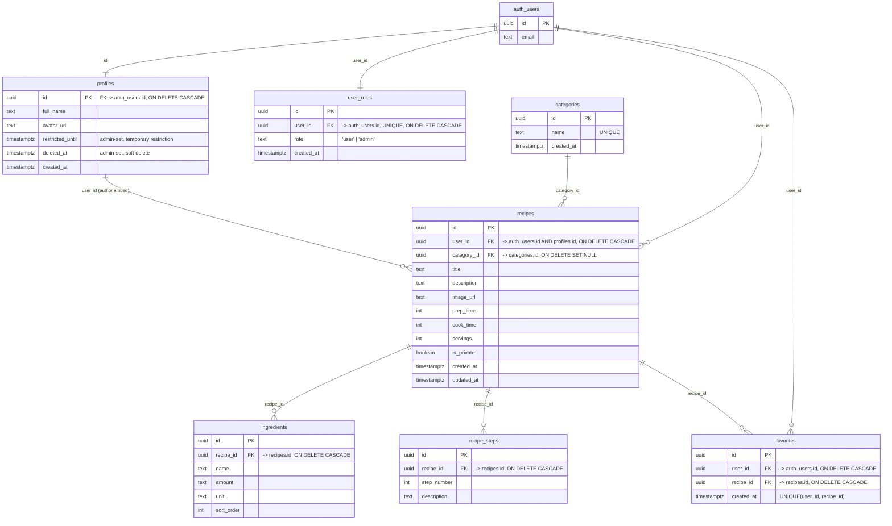

# Database schema

Source of truth: [`supabase/migrations/`](../supabase/migrations/), applied in filename order.
This diagram and the table notes below are a snapshot of that history — if they
ever disagree with the migrations, the migrations are correct.

## Entity-relationship diagram

`auth_users` represents Supabase's built-in `auth.users` table — it's managed by
Supabase Auth, not by a migration in this repo.

## Tables

| Table | Purpose |
|---|---|
| `profiles` | One row per user, 1:1 with `auth.users`. Created automatically by the `handle_new_user` trigger on signup. Holds display info (`full_name`, `avatar_url`) plus admin-controlled account status (`restricted_until`, `deleted_at`) — see [admin-setup.md](./admin-setup.md). |
| `user_roles` | One row per user, assigns `role` (`'user'` or `'admin'`), also created by `handle_new_user`. Read via the `public.is_admin()` `SECURITY DEFINER` helper to avoid recursive RLS checks. |
| `categories` | Recipe categories (Breakfast, Dinner, ...). Readable by everyone, writable only by admins. |
| `recipes` | A user-authored recipe: title, description, image, timing, servings, category, and `is_private` (hide from other users' feeds). |
| `ingredients` | Ingredient lines for a recipe, ordered by `sort_order`. Deleted along with the recipe. |
| `recipe_steps` | Ordered instructions for a recipe (`step_number`). Deleted along with the recipe. |
| `favorites` | Join table letting a user bookmark a recipe. `UNIQUE(user_id, recipe_id)` prevents duplicate favorites; both FKs cascade on delete. |

## Notable design details

- **`recipes.user_id` has two foreign keys** — one to `auth.users(id)` (the
  original ownership FK) and one to `profiles(id)` (added later, see
  [20260702000003](../supabase/migrations/20260702000003_public_read_and_author_fk.sql)).
  Both are safe because `profiles.id` always equals the owning `auth.users.id`;
  the second FK exists purely so PostgREST can embed `profiles(...)` (the
  recipe author) in a single `recipes` query.
- **Admin checks avoid RLS recursion** via `public.is_admin()`, a
  `SECURITY DEFINER` function that reads `user_roles` bypassing RLS (see
  [20260702000004](../supabase/migrations/20260702000004_fix_user_roles_recursion.sql)).
  A naive policy that queries `user_roles` from inside a `user_roles` policy
  causes Postgres error `42P17` (infinite recursion) — use `is_admin()`
  instead of inlining that subquery in any new policy.
- **Row Level Security is enabled on all 7 tables.** Every table's access
  rules live in `supabase/migrations/`, not in application code — the
  frontend has no authorization logic of its own; it relies on RLS to
  enforce ownership and admin checks.
- **Indexes**: besides the automatic indexes on primary keys and unique
  constraints, `recipes(user_id)`, `recipes(category_id)`,
  `ingredients(recipe_id)`, `recipe_steps(recipe_id)`, and
  `favorites(recipe_id)` are explicitly indexed (see
  [20260706000003](../supabase/migrations/20260706000003_add_missing_indexes.sql))
  since Postgres does not index foreign key columns automatically.
- **Storage**: two public buckets, `recipe-images` and `avatars`, each with
  owner-scoped upload/update/delete policies keyed on the first path segment
  (`storage.foldername(name)[1] = auth.uid()::text`) and public read access.
